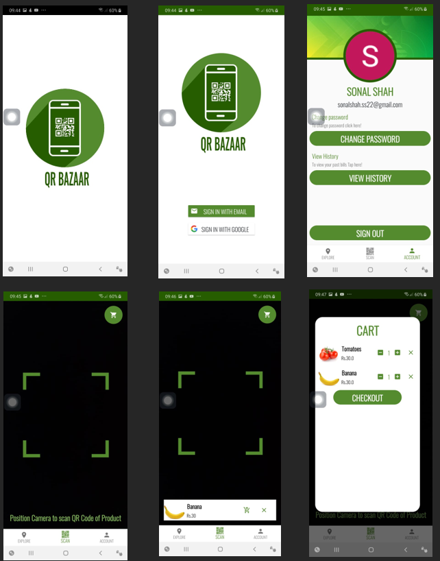
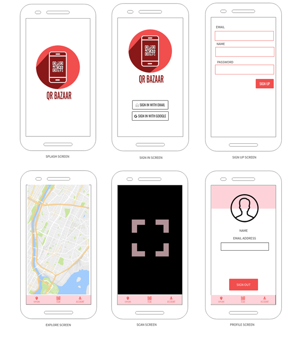

# QR-Bazaar

# ABSTRACT

In the 21st century, people live a fast life. There is no time left with people to wait in long queues to shop to get daily essentials. To prevent this time wastage and provide a cashless flow of transaction this app “QR BAZZAR” was created.

QR BAZZAR is an app that allows users to shop from stores where shopping, billing and checkout is done by the user themselves. The user uses the app to scan a unique QR code for a product to add it to their card. When done shopping, the user can use the different online payment for checking out and generate the bill. The bill can be shown to employee at the exits who verifies the bill.

The app also will help people keep a track of their expenses on daily use products bought through the app. This help in cost management which is much needed by today’s youth.

This idea of this app is to provide fast, efficiency and time saving method of shopping and checkout for daily need items.

# Problem Definition 

In the 21st Century, people are always on the go people and barely have time for buying daily need items. 

This is often attributable to: -Time wastage in long queues, Requirement of cash for small payment & Monetary tracking of expenses.

QR BAZZAR will help people overcome these barriers, by simply letting people self checkout from stores near them. This will help the users to shop and stay cashless wherever they go by just using the app while not having wait in long queues at shopping marts.

Some other problem solved would be that there would be no need to affiliate to any brand or to invest in expensive hardware by the shopkeeper, which is a problem with current aps in the market.

Monetary expenses can be measured by the people to efficiently calculate funds that they send via  the app hence providing then a round idea of what/how much do they spend on a certain type of products.

# Market Review

Apps that inspired QR Bazzar are: -
•	Amazon go
•	Moltin Self Checkout
•	Walmart Scan & Go

QR BAZZAR integrates a few features from all the apps mentioned above, and also has a better UI. This makes the app even more compelling to use, as compared to the competition, it is simpler to set up and use both for the shopkeepers and consumers. 

The apps that have been mentioned above aren’t used as they are not available in all regions. The reason why people would choose this app, apart from the UI, would be the assurance that the app functionality won’t be affected by any future Android updates/patches, as the app would be maintained regularly. The set up of such a store would also be pretty simple with the Shopkeeper side of the app which is planned for the future.

# REQUIREMENTS
Software Requirements: 
•	Minimum API – Level 23 (Android 6.0 Marshmallow)
•	Target API – Level 29 (Android 10)

Hardware Requirements
•	Camera
•	Internet Connectivity (Wi-Fi / Mobile Data)

# Data Flow

# Mockups

# Gantt Chart

# Refrenece 

Tim Buchalka’s Android Java Masterclass: - https://www.udemy.com/course/master-android-7-nougat-java-app-development-step-by-step/

Android Jetpack: - https://developer.android.com/jetpack

Google Firebase: - https://firebase.google.com/docs

QR detection: - https://android-developers.googleblog.com/2015/08/barcode-detection-in-google-play.html

Glide library: - https://github.com/bumptech/glide

# FUTURE PLANS

1. Expenditure management via app

2. History of paid bills

3. Shop owner side of the app which has regular analysis of sales and profits using AI.

